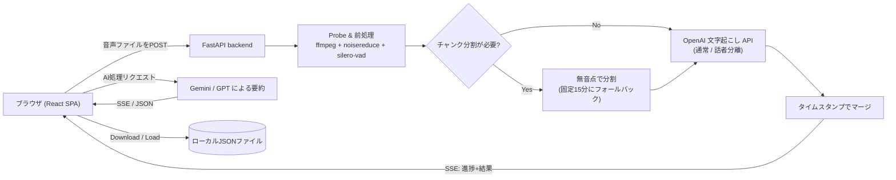

# meeting-transcriber

会議・講義の長時間録音を、検索可能な構造化ノートに変換する Web アプリ。ノイズ低減・無音カット・話者分離対応の文字起こし・AI要約を1本のパイプラインでこなす。

[English](README.md) | [日本語](README.ja.md) | [中文](README.zh.md)


## Why

文字起こし API は分単位で課金される。生の会議・講義音声には無音・言い淀み・背景ノイズが大量に含まれており、それらは情報を増やさずコストだけを増やす。本プロジェクトは、有料 API に届く前にその無駄を自動的に削り落とし、得られた文字起こしを「章立ての講義ノート」「試験対策 Q&A」「決定事項・タスクを抜き出した議事録」など実際に使えるノートへ変換することを目的に作った。単なる生テキストの羅列では終わらせない。加えて、無料枠 PaaS のメモリ予算に収まるように設計している。

## Features

- **音声前処理パイプライン** — 定常ノイズ低減（`noisereduce`）と VAD ベースの無音カット（`silero-vad`）を組み合わせ、課金対象になる前に非発話区間を除去する。実測で課金分数を10〜30%削減。プロファイルは3種類: `standard`、`aggressive`（余白を最小化）、`raw`（前処理なし・精度優先）。
- **長時間録音の自動チャンク分割** — OpenAI の1リクエスト上限を超えるファイルは、自然な無音点で分割する（適した無音点が無ければ固定15分間隔にフォールバック）。最大3チャンク並列で文字起こしし、タイムオフセットを揃えて1本の連続テキストにマージする。
- **3段階の文字起こしモデル** — OpenAI の文字起こし API を使用し、高精度モデル・低コストな「mini」モデル・**話者分離**モデル（話者ラベルとタイムスタンプ付きセグメントを返す）を切り替えられる。
- **AI後処理（Gemini / GPT）** — 組み込みプロンプトテンプレート10種（要約・詳細サマリー・要点整理・決定事項・アクションアイテム・未解決事項・AI向け整形、講義向けの章立てノート・試験対策Q&Aの2種）。講義向けプロンプトは「文字起こしに無い情報を勝手に補わない」ことを徹底し、聞き取りミスと思われる固有名詞などを補正した場合は「文字起こし補正メモ」セクションに必ず明記させ、読み手が誤補正を検証できるようにしている。
- **文脈付きチャット** — 元の文字起こしと生成済みAI出力を根拠に質問へ回答する。根拠が資料に無い場合は「資料には記載がありません」と明言し、コンテキスト外の推測をしない。
- **ステートレスなバックエンド** — サーバ側には何も永続化しない。各ジョブは一時ディレクトリの中だけで処理され、完了時に削除される。DBは無い。履歴（文字起こし・AI出力・チャット）はすべてブラウザ側の状態として保持し、JSONファイルへのダウンロード / 読み込みで永続化できる。
- **リアルタイム進捗** — Server-Sent Events でパイプラインの各段階（probe・前処理・チャンク分割・文字起こし・マージ）を逐次通知する。
- **任意のハンドオフ認証** — 外部ポータル経由のアクセス制御用に HMAC 署名付きトークン/セッションのフローを備える。`HMAC_SECRET` 未設定時（ローカル開発など）は自動的に無効化される。

## Architecture



フロントエンドとバックエンドは**同一オリジン**で配信される。Docker イメージのビルド時に React アプリを生成し、`/api/*` を公開する同じ FastAPI プロセスが静的ファイルも配信するため、本番環境で CORS 設定は不要。

## Tech Stack

**Backend** — FastAPI、Python 3.12、`openai` SDK（文字起こし + GPT）、`google-genai` SDK（Gemini）、`noisereduce`、`silero-vad`（`torch.hub` からロード、CPU専用の `torch`/`torchaudio`）、音声I/Oとチャンク分割用の `pydub` + `ffmpeg`、進捗ストリーミング用の `sse-starlette`。

**Frontend** — React 19、TypeScript、Vite、Tailwind CSS 4、React Router 7、AI出力の描画に `react-markdown`。

**Infrastructure** — マルチステージ `Dockerfile`（Node ビルドステージ → Python ランタイムステージ）。Docker 対応の PaaS であればコンテナ1つでデプロイ可能。後述の Render デプロイに加え `railway.json` も同梱している。

## Getting Started

必要環境: Python 3.12+、Node.js 20+、`ffmpeg`（PATH 上に必要）、自分の OpenAI / Google AI の API キー。

```bash
git clone https://github.com/Tomato-1101/meeting-transcriber.git
cd meeting-transcriber

# Backend
cd backend
python -m venv .venv && source .venv/bin/activate
pip install -r requirements.txt
cp ../.env.example .env   # OPENAI_API_KEY / GOOGLE_API_KEY を記入
uvicorn app.main:app --reload --port 8000

# Frontend（別ターミナル）
cd frontend
npm install
npm run dev   # http://localhost:5173 、/api は :8000 へプロキシ
```

`scripts/dev.sh` で両プロセスをまとめて起動できる。`HMAC_SECRET` が未設定の場合（ローカル開発の既定状態）は認証が自動的にスキップされる。

本番と同じ構成を試すには:

```bash
docker build -t meeting-transcriber .
docker run -p 8000:8000 -e OPENAI_API_KEY=... -e GOOGLE_API_KEY=... meeting-transcriber
```

## Project Structure

```
meeting-transcriber/
├── backend/
│   └── app/
│       ├── main.py              # FastAPIアプリ本体、認証ミドルウェア、SPA fallback
│       ├── auth.py               # HMAC handoff / session トークン検証
│       ├── routers/              # transcribe / ai_processing / chat
│       ├── services/
│       │   ├── audio_preprocessor.py   # ノイズ低減 + VAD無音カット
│       │   ├── audio_processor.py      # probe + 無音点ベースのチャンク分割
│       │   ├── transcription_service.py# パイプライン全体のオーケストレーション
│       │   ├── openai_client.py        # 文字起こしAPI呼び出し
│       │   └── ai_service.py           # 要約プロンプト + Gemini/GPT呼び出し
│       └── utils/                # ジョブ進捗管理、ロギング
├── frontend/
│   └── src/
│       ├── components/            # アップロード、進捗、文字起こし表示、AIパネル、チャット
│       ├── hooks/useJobProgress.ts# SSE受信
│       ├── state/HistoryContext.tsx# クライアント側履歴ストア
│       └── pages/
└── Dockerfile                    # マルチステージ: フロントビルド → バックエンドランタイム
```

## Design Decisions

**512MB の無料枠コンテナに収める設計。** 本アプリは Render の無料プラン（512MB RAM・15分アイドルでスリープ）を主なターゲットにしている。`torch` + `noisereduce` + `silero-vad` を積むと実測でこの上限にかなり近づく。メモリ逼迫が問題になった場合の打ち手を、精度・レイテンシへの影響が小さい順に並べると:

- **`torch` の lazy import** — プロセス起動時ではなく、実際に前処理ジョブが走るときだけ import する。アイドル時のメモリを低く保ち、コストを最初のリクエストだけに寄せる。
- **`noisereduce` を外す** — VAD ベースの無音カットだけに絞る。実用上のメリットの大部分はこれだけでも得られ、メモリ消費は大きく減る。
- **有料プランへのアップグレード** — 上記2つで足りなければ Render Starter（月額約$7で1GB）に上げる。

**ステートレス設計への転換。** 以前のバージョンはジョブをDBに永続化していたが、後にバックエンドを完全ステートレス（リクエストごとの一時ディレクトリ・DB無し）に書き直した。履歴とプライバシーの責任をクライアント側に寄せることで、サーバ側はデプロイをまたいで失う・バックアップする・漏らすものを何も持たない。

## Status

エンドツーエンドで動作し、個人利用（自分の会議・講義録音）向けにデプロイ済み。認証はシングルユーザー前提（マルチテナント向けではなく、個人用ポータルの裏に置く想定）。自動テストスイートは無く、実運用での動作確認によって正しさを検証している。リリーススケジュールに沿った継続メンテナンスはしておらず、必要に応じて手を入れる個人用ツールという位置づけ。

## License

[MIT](LICENSE)
