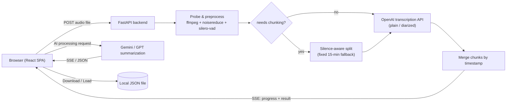

# meeting-transcriber

Turn long meeting and lecture recordings into searchable, structured notes — noise reduction, silence trimming, speaker-aware transcription, and AI summarization in one pipeline.

[English](README.md) | [日本語](README.ja.md) | [中文](README.zh.md)


## Why

Transcription APIs bill by the minute, and a raw meeting or lecture recording is full of silence, filler, and background noise that adds cost without adding information. This project exists to strip that waste out automatically before it ever reaches a paid API, and to turn the resulting transcript into notes that are actually useful — chaptered lecture notes, exam-ready Q&A, or a meeting summary with decisions and action items pulled out — instead of a wall of raw text. It was also built to run affordably: the whole stack is designed to fit inside a free-tier PaaS memory budget.

## Features

- **Audio preprocessing pipeline** — stationary noise reduction (`noisereduce`) followed by VAD-based silence trimming (`silero-vad`) removes non-speech audio before it's billed, typically cutting transcribed minutes by 10–30%. Three profiles are available: `standard`, `aggressive` (tighter padding), and `raw` (no preprocessing, for when accuracy matters more than cost).
- **Automatic chunking for long recordings** — files that exceed OpenAI's per-request limits are split at natural silence points (falling back to fixed 15-minute windows if no good silence gap exists), transcribed concurrently (up to 3 chunks in parallel), and merged back into one continuous, correctly time-offset transcript.
- **Three transcription tiers** via the OpenAI transcription API: a high-accuracy model, a lower-cost "mini" model, and a **speaker-diarized** model that returns per-speaker segments with timestamps.
- **AI post-processing** with Gemini or GPT across 10 built-in prompt templates — meeting summary, detailed summary, key points, decisions, action items, unresolved items, AI-friendly reformatting, plus two lecture-specific formats (chaptered notes and exam Q&A). The lecture prompts are written to never invent information that isn't in the transcript, and to log any transcription-error correction they make (e.g. a misheard proper noun) in an explicit "correction memo" section so the reader can spot-check it.
- **Follow-up chat** grounded in the original transcript and the generated AI output — it explicitly refuses to answer from outside that context.
- **Stateless backend** — nothing is persisted server-side. Each job runs inside a temporary directory that's deleted when the job finishes; there is no database. History (transcripts, AI results, chat threads) lives entirely in the browser and can be exported to / re-imported from a JSON file.
- **Real-time progress** over Server-Sent Events, covering every pipeline stage (probing, preprocessing, chunking, transcribing, merging).
- **Optional handoff authentication** — an HMAC-signed token/session flow for gating access behind an external portal, automatically disabled when no secret is configured (e.g. local development).

## Architecture



The frontend and backend are served from a **single origin**: the Docker image builds the React app and serves the static bundle from the same FastAPI process that exposes `/api/*`, so there's no CORS to configure in production.

## Tech Stack

**Backend** — FastAPI, Python 3.12, `openai` SDK (transcription + GPT), `google-genai` SDK (Gemini), `noisereduce`, `silero-vad` (loaded via `torch.hub`, CPU-only `torch`/`torchaudio`), `pydub` + `ffmpeg` for audio I/O and chunking, `sse-starlette` for progress streaming.

**Frontend** — React 19, TypeScript, Vite, Tailwind CSS 4, React Router 7, `react-markdown` for rendering AI output.

**Infrastructure** — multi-stage `Dockerfile` (Node build stage → Python runtime stage), deployable as a single container to any Docker-friendly PaaS; a `railway.json` is included alongside the Render deployment described below.

## Getting Started

Requirements: Python 3.12+, Node.js 20+, `ffmpeg` on `PATH`, and your own OpenAI / Google AI API keys.

```bash
git clone https://github.com/Tomato-1101/meeting-transcriber.git
cd meeting-transcriber

# Backend
cd backend
python -m venv .venv && source .venv/bin/activate
pip install -r requirements.txt
cp ../.env.example .env   # fill in OPENAI_API_KEY / GOOGLE_API_KEY
uvicorn app.main:app --reload --port 8000

# Frontend (separate terminal)
cd frontend
npm install
npm run dev   # http://localhost:5173, proxies /api to :8000
```

`scripts/dev.sh` starts both processes together. Authentication is skipped automatically when `HMAC_SECRET` isn't set, which is the default for local development.

To run the whole stack as it's deployed in production:

```bash
docker build -t meeting-transcriber .
docker run -p 8000:8000 -e OPENAI_API_KEY=... -e GOOGLE_API_KEY=... meeting-transcriber
```

## Project Structure

```
meeting-transcriber/
├── backend/
│   └── app/
│       ├── main.py              # FastAPI app, auth middleware, SPA fallback
│       ├── auth.py               # HMAC handoff / session token verification
│       ├── routers/              # transcribe / ai_processing / chat
│       ├── services/
│       │   ├── audio_preprocessor.py   # noise reduction + VAD silence trim
│       │   ├── audio_processor.py      # probing + silence-aware chunking
│       │   ├── transcription_service.py# pipeline orchestration
│       │   ├── openai_client.py        # transcription API calls
│       │   └── ai_service.py           # summarization prompts + Gemini/GPT calls
│       └── utils/                # job progress tracking, logging
├── frontend/
│   └── src/
│       ├── components/            # upload, progress, transcript view, AI panel, chat
│       ├── hooks/useJobProgress.ts# SSE consumption
│       ├── state/HistoryContext.tsx# client-side history store
│       └── pages/
└── Dockerfile                    # multi-stage: frontend build → backend runtime
```

## Design Decisions

**Fitting inside a 512MB free-tier container.** The app targets Render's free plan (512MB RAM, sleeps after 15 minutes idle). `torch` + `noisereduce` + `silero-vad` push memory usage close to that ceiling in practice. If memory pressure becomes a problem, the mitigations — in order of how much they cost in accuracy/latency — are:

- **Lazy-import `torch`** only when a job actually runs preprocessing, instead of at process startup, so idle memory stays low and only the first request pays the import cost.
- **Drop `noisereduce`** and rely on VAD-based silence trimming alone — it covers most of the practical benefit for a fraction of the memory.
- **Upgrade to a paid tier** (Render Starter, ~$7/month for 1GB) if neither of the above is enough.

**Stateless by design.** Earlier versions persisted jobs to a database; the backend was later rewritten to be fully stateless (temp directory per request, no DB) so that history and privacy are the client's responsibility, and the server has nothing to lose, back up, or leak between deploys.

## Status

Working end-to-end and deployed for personal use (own meeting and lecture recordings). Single-user auth model — it's built to sit behind a personal portal, not for multi-tenant use. There is no automated test suite; correctness has been validated through real usage. Not actively maintained on a release schedule — it's a personal tool that evolves as needed.

## License

[MIT](LICENSE)
