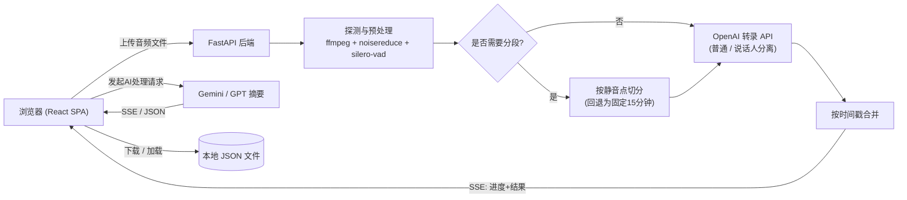

# meeting-transcriber

将冗长的会议和讲座录音,转换为可检索的结构化笔记的 Web 应用——降噪、静音裁剪、支持说话人分离的转录、AI 摘要,全部整合在一条流水线中完成。

[English](README.md) | [日本語](README.ja.md) | [中文](README.zh.md)


## Why(为什么做这个)

转录 API 按分钟计费,而原始的会议或讲座录音里充斥着静音、口头禅和背景噪音——这些内容不增加信息量,却白白增加成本。这个项目的初衷,就是在音频送到付费 API 之前自动剔除这些无效部分,并把最终的转录文本转换成真正有用的笔记——带章节的讲义笔记、考试用的问答整理、或是提取出决定事项与行动项的会议纪要——而不是一堆未经整理的原始文字。同时,整个技术栈也刻意控制在免费层 PaaS 的内存预算之内运行。

## Features(功能)

- **音频预处理流水线** —— 先做平稳噪声抑制(`noisereduce`),再用基于 VAD 的静音裁剪(`silero-vad`)去除非语音部分,在计费之前先减少时长,实测可减少 10%–30% 的计费分钟数。提供三种模式:`standard`(标准)、`aggressive`(更激进的裁剪)、`raw`(不做预处理,优先保证准确率)。
- **长录音自动分段** —— 超过 OpenAI 单次请求限制的文件会在自然的静音点处切分(找不到合适的静音点时回退为固定 15 分钟一段),最多 3 段并行转录,再按时间偏移拼接回一份连续的转录文本。
- **三档转录模型** —— 通过 OpenAI 转录 API 可选择高精度模型、低成本的 "mini" 模型,以及**说话人分离**模型(返回带说话人标签和时间戳的分段)。
- **AI 后处理(Gemini / GPT)** —— 内置 10 种提示词模板:摘要、详细摘要、要点整理、决定事项、行动项、未解决事项、便于 AI 二次处理的格式化,以及两种讲座专用格式(分章节笔记、考试问答)。讲座类提示词明确要求"不得编造转录文本中没有的信息",若对疑似识别错误的专有名词等做出了推测性修正,必须在"转录修正备注"章节中逐条列出,方便读者核查。
- **基于上下文的追问对话** —— 以原始转录文本和已生成的 AI 输出为依据回答问题;若资料中没有依据,会明确回复"资料中未提及",不做上下文之外的臆测。
- **无状态后端** —— 服务端不持久化任何数据。每个任务都在一个临时目录中处理,任务结束后立即删除,没有数据库。历史记录(转录、AI 结果、对话)完全保存在浏览器状态中,可下载为 JSON 文件或重新导入。
- **实时进度** —— 通过 Server-Sent Events 推送流水线每个阶段(探测、预处理、分段、转录、合并)的进度。
- **可选的 handoff 认证** —— 提供基于 HMAC 签名的令牌/会话流程,用于接入外部门户做访问控制;未设置 `HMAC_SECRET` 时(例如本地开发)会自动关闭认证。

## Architecture(架构)



前端和后端由**同一个源**提供服务:Docker 镜像在构建阶段生成 React 应用,由暴露 `/api/*` 的同一个 FastAPI 进程一并托管静态文件,因此生产环境中无需配置 CORS。

## Tech Stack(技术栈)

**后端** —— FastAPI、Python 3.12、`openai` SDK(转录 + GPT)、`google-genai` SDK(Gemini)、`noisereduce`、`silero-vad`(通过 `torch.hub` 加载,使用仅 CPU 的 `torch`/`torchaudio`)、用于音频 I/O 与分段的 `pydub` + `ffmpeg`、用于进度推送的 `sse-starlette`。

**前端** —— React 19、TypeScript、Vite、Tailwind CSS 4、React Router 7、用 `react-markdown` 渲染 AI 输出。

**基础设施** —— 多阶段构建的 `Dockerfile`(Node 构建阶段 → Python 运行时阶段),可作为单个容器部署到任意支持 Docker 的 PaaS;除了下文提到的 Render 部署经验外,仓库中也附带了 `railway.json`。

## Getting Started(快速开始)

环境要求:Python 3.12+、Node.js 20+、`PATH` 中需要有 `ffmpeg`,以及你自己的 OpenAI / Google AI API 密钥。

```bash
git clone https://github.com/Tomato-1101/meeting-transcriber.git
cd meeting-transcriber

# 后端
cd backend
python -m venv .venv && source .venv/bin/activate
pip install -r requirements.txt
cp ../.env.example .env   # 填入 OPENAI_API_KEY / GOOGLE_API_KEY
uvicorn app.main:app --reload --port 8000

# 前端(另开一个终端)
cd frontend
npm install
npm run dev   # http://localhost:5173 ,/api 会代理到 :8000
```

`scripts/dev.sh` 可以同时启动前后端两个进程。当 `HMAC_SECRET` 未设置时(本地开发的默认状态),认证会自动跳过。

如需体验与生产环境一致的完整构建:

```bash
docker build -t meeting-transcriber .
docker run -p 8000:8000 -e OPENAI_API_KEY=... -e GOOGLE_API_KEY=... meeting-transcriber
```

## Project Structure(项目结构)

```
meeting-transcriber/
├── backend/
│   └── app/
│       ├── main.py              # FastAPI 应用主体、认证中间件、SPA fallback
│       ├── auth.py               # HMAC handoff / session 令牌校验
│       ├── routers/              # transcribe / ai_processing / chat
│       ├── services/
│       │   ├── audio_preprocessor.py   # 降噪 + VAD 静音裁剪
│       │   ├── audio_processor.py      # 探测音频信息 + 按静音点分段
│       │   ├── transcription_service.py# 流水线整体编排
│       │   ├── openai_client.py        # 调用转录 API
│       │   └── ai_service.py           # 摘要提示词 + 调用 Gemini/GPT
│       └── utils/                # 任务进度管理、日志
├── frontend/
│   └── src/
│       ├── components/            # 上传、进度、转录文本展示、AI面板、对话
│       ├── hooks/useJobProgress.ts# 接收 SSE
│       ├── state/HistoryContext.tsx# 客户端历史记录存储
│       └── pages/
└── Dockerfile                    # 多阶段构建:前端构建 → 后端运行时
```

## Design Decisions(设计决策)

**在 512MB 免费层容器中运行的设计。** 本应用以 Render 免费方案(512MB 内存、闲置 15 分钟后休眠)为主要目标环境。加载 `torch` + `noisereduce` + `silero-vad` 后,实测内存占用已经相当接近这个上限。如果内存压力成为问题,按照对准确率/延迟影响从小到大排列,应对手段依次是:

- **延迟导入(lazy import)`torch`** —— 只在实际执行预处理任务时才导入,而不是在进程启动时导入,让空闲状态下的内存占用保持低位,把导入成本只转嫁给第一个请求。
- **去掉 `noisereduce`** —— 仅依赖基于 VAD 的静音裁剪。在实际使用中,这一项已经能覆盖大部分收益,同时大幅降低内存占用。
- **升级到付费方案** —— 如果以上两项仍不够,再升级到 Render Starter(约每月 $7,提供 1GB 内存)。

**转向无状态架构。** 早期版本会把任务持久化到数据库;后来把后端重写为完全无状态(每个请求使用独立的临时目录,不使用数据库),把历史记录和隐私的责任交给客户端,服务端因此在多次部署之间没有任何需要保留、备份或可能泄露的数据。

## Status(项目状态)

已实现端到端的完整流程,并已部署用于个人日常使用(自己的会议和讲座录音)。认证模型面向单用户设计——它被设计为运行在个人门户网站背后,而非面向多租户场景。目前没有自动化测试套件,正确性通过实际使用来验证。没有按发布计划持续维护,是一个按需迭代的个人工具。

## License(许可证)

[MIT](LICENSE)
